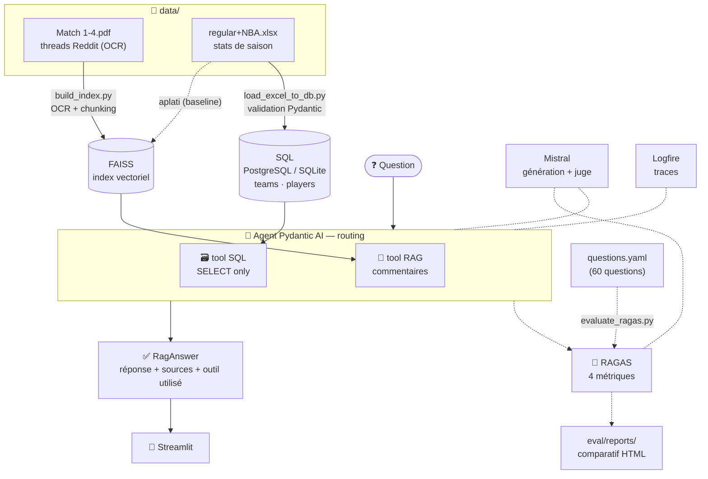

<a id="readme-top"></a>

<div align="center">

# 🏀 NBA Analyst AI — SportSee

**Assistant conversationnel RAG + SQL, évalué objectivement avec RAGAS**
*Projet OpenClassrooms P10 — « Évaluez les performances d'un LLM »*

[](https://www.python.org/)
[](https://docs.astral.sh/uv/)
[](https://ai.pydantic.dev/)
[](https://mistral.ai/)
[](https://docs.ragas.io/)

**Fidélité des réponses ×2.5, précision du contexte ×4.3** — mesuré par RAGAS sur
60 questions métier, en remplaçant le retrieval texte des données chiffrées par un
**tool SQL** routé par un **agent**.

[📊 Rapport comparatif](eval/reports/comparatif_baseline_v2.html) ·
[🧪 Harness RAGAS](eval/evaluate_ragas.py) ·
[🤖 Agent](src/sportsee_rag/agent/agent.py)

</div>

---

<details>
<summary>📑 Sommaire</summary>

- [À propos du projet](#-à-propos-du-projet)
- [Résultats](#-résultats)
- [Architecture](#-architecture)
- [Démarrage](#-démarrage)
- [Utilisation](#-utilisation)
- [Évaluation RAGAS](#-évaluation-ragas)
- [Tests](#-tests)
- [Structure du dépôt](#-structure-du-dépôt)
- [Limites connues](#-limites-connues)

</details>

## 📌 À propos du projet

SportSee dispose d'un prototype d'assistant NBA qui répond bien aux questions
*textuelles* (débats de fans) mais **échoue sur les questions chiffrées** : les
statistiques Excel, aplaties en texte puis découpées en chunks, sont illisibles
pour le retrieval sémantique.

Ce dépôt couvre le cycle complet demandé par le brief :

1. **Auditer** le prototype avec un harnais d'évaluation **RAGAS** (60 questions
   métier, 6 catégories : texte, chiffré simple/complexe, bruité, hors-couverture, mixte) ;
2. **Enrichir** le système : base SQL validée par **Pydantic** + tool **NL→SQL**
   (LangChain), routés par un **agent Pydantic AI** ;
3. **Ré-évaluer** avec le même harnais et analyser le delta avant/après,
   le tout tracé pas à pas dans **Logfire**.

Deux sources de données, deux outils :

| Source | Contenu | Outil |
|---|---|---|
| `Match 1-4.pdf` | threads Reddit de fans (scans → OCR) | 🔎 RAG (FAISS, cosinus) |
| `regular+NBA.xlsx` | stats d'une saison régulière (569 joueurs) | 🗃️ SQL (SELECT only) |

L'agent choisit seul, pour chaque question, l'outil à interroger — RAG, SQL, ou
les deux — et répond **uniquement** à partir de leurs résultats.

<p align="right">(<a href="#readme-top">retour en haut</a>)</p>

## 📊 Résultats

Scores RAGAS moyens (60 questions, hors catégorie `hors_couverture`,
juge `mistral-small`) — prototype vs agent final :

| Métrique | Prototype (baseline) | Agent RAG + SQL (v2) | Δ |
|---|---:|---:|---:|
| `faithfulness` | 0.36 | **0.88** | **×2.5** |
| `context_precision` | 0.17 | **0.71** | **×4.3** |
| `context_recall` | 0.26 | **0.76** | **×2.9** |
| `answer_relevancy` | 0.76 | **0.83** | +0.07 |

Trois systèmes mesurés pour isoler chaque effet :

- **`baseline`** — RAG texte seul, Excel aplati dans l'index (reproduit le bug du prototype) ;
- **`enriched`** — agent RAG + SQL sur l'index complet : isole **l'apport du tool SQL** ;
- **`enriched_v2`** — même agent sur un index **PDF-only** (l'Excel ne passe plus que
  par SQL) + **garde-fou de périmètre** : le run de référence.

➡️ Analyse détaillée, radars par catégorie et verdicts question par question :
[`eval/reports/comparatif_baseline_v2.html`](eval/reports/comparatif_baseline_v2.html).

<p align="right">(<a href="#readme-top">retour en haut</a>)</p>

## 🏗️ Architecture



**Sécurité DB** : l'application tourne avec un rôle **SELECT-only**
(`DATABASE_URL_READONLY`) ; seul le script de chargement utilise le rôle admin.
Défense en profondeur (garde applicatif + rôle PostgreSQL), vérifiée par
[`scripts/check_db_readonly.py`](scripts/check_db_readonly.py).

### Stack

Python 3.12 · UV · Pydantic AI · Mistral · FAISS · LangChain (`SQLDatabase`) ·
SQLAlchemy · PostgreSQL/Supabase (repli SQLite) · RAGAS · Pydantic Logfire ·
Streamlit · EasyOCR/PyTorch.

<p align="right">(<a href="#readme-top">retour en haut</a>)</p>

## 🚀 Démarrage

### Prérequis

- **Python 3.12** et **[UV](https://docs.astral.sh/uv/)**
- Une **clé API Mistral** (gratuite) — <https://console.mistral.ai/>
- *(optionnel)* un **GPU CUDA** : accélère l'OCR à l'indexation (sinon CPU, plus lent)
- *(optionnel)* un projet **Supabase / PostgreSQL** : sinon repli automatique sur SQLite local

### Installation

```powershell
# 1. Dépendances (environnement reproductible)
uv sync

# 2. Secrets : copier le modèle et renseigner la clé Mistral
Copy-Item .env.example .env
# puis éditer .env → MISTRAL_API_KEY=...  (les autres variables sont optionnelles)
```

| Variable (`.env`) | Requis | Rôle |
|---|---|---|
| `MISTRAL_API_KEY` | ✅ | génération, embeddings, juge RAGAS |
| `DATABASE_URL` | ⚪ | rôle **admin** — chargement Excel → SQL uniquement |
| `DATABASE_URL_READONLY` | ⚪ | rôle **SELECT-only** — runtime de l'app |
| `LOGFIRE_TOKEN` | ⚪ | traces cloud (sinon Logfire tourne en local) |

> Sans `DATABASE_URL`, le projet bascule sur une base **SQLite** locale
> (`db/nba.sqlite`) — pratique pour tester hors-ligne.

### Mise en route

```powershell
# 3. Construire l'index vectoriel (OCR des PDF + embeddings)
uv run python scripts/build_index.py
# variante PDF-only pour enriched_v2 (Excel exclu du retrieval texte) :
uv run python scripts/build_index.py --pdf-only

# 4. Charger les stats Excel dans la base SQL
uv run python scripts/load_excel_to_db.py

# (optionnel) vérifier que le rôle applicatif est bien en lecture seule
uv run python scripts/check_db_readonly.py
```

<p align="right">(<a href="#readme-top">retour en haut</a>)</p>

## 💬 Utilisation

```powershell
# Interface de chat (recommandé)
uv run streamlit run streamlit_app.py

# …ou en ligne de commande, pour une question ponctuelle
uv run python scripts/ask.py "Quelles équipes ont impressionné en playoffs ?"
```

Chaque réponse affiche **l'outil utilisé** (RAG, SQL, les deux — ou aucun,
signalé comme réponse sans preuve) et ses **sources**.

## 📏 Évaluation RAGAS

```powershell
# Prototype d'origine (RAG texte seul, Excel aplati dans l'index)
uv run python eval/evaluate_ragas.py --system baseline

# Agent RAG + SQL sur l'index complet
uv run python eval/evaluate_ragas.py --system enriched

# Agent RAG + SQL sur l'index PDF-only + garde-fou de périmètre (run de référence)
# → nécessite l'index PDF-only : build_index.py --pdf-only (cf. Mise en route)
uv run python eval/evaluate_ragas.py --system enriched_v2

# Ajouter --limit 2 pour un test rapide (2 questions)
```

Le harnais est **strictement identique** entre les trois systèmes (mêmes
questions, même juge, mêmes métriques) : seul le flag `--system` change, donc le
delta mesure bien le système et non le protocole. Chaque run écrit un rapport
JSON + tableau Markdown dans [`eval/reports/`](eval/reports/).

## 🧪 Tests

```powershell
uv run pytest
```

Approche pragmatique : le déterministe (schéma SQL, garde-fous, parsing,
routing de l'agent) est couvert par des tests unitaires ; les appels LLM sont
mockés (`TestModel` de Pydantic AI, fakes injectés) — aucun test ne touche le réseau.

<p align="right">(<a href="#readme-top">retour en haut</a>)</p>

## 🗂️ Structure du dépôt

```
src/sportsee_rag/
  ingestion/     chargement & parsing du corpus (PDF/OCR, Excel, docx)
  retrieval/     index FAISS (cosinus) + recherche
  rag/           pipeline RAG (retrieve → prompt → réponse)
  sql/           schéma, chargement Excel→SQL, tool SQL (SELECT-only)
  agent/         agent Pydantic AI (routing RAG / SQL)
  llm/           client Mistral (retry/backoff)
  config.py      configuration typée (pydantic-settings)
  observability  Logfire
scripts/         entrypoints : build_index, load_excel_to_db, ask, check_db_readonly
eval/            harness RAGAS, questions.yaml, rapports & comparatifs
tests/           tests unitaires offline (pytest)
data/            corpus source (4 PDF de match + classeur NBA)
```

## ⚠️ Limites connues

- **PDF de match = scans OCRisés** (threads Reddit) : texte bruité par nature →
  plafonne certaines métriques de contexte même quand la réponse est correcte.
- **Juge RAGAS = `mistral-small`** (gratuit), pas un modèle frontière : les scores
  sont *indicatifs* ; le signal fiable est le **delta** baseline → enrichi.
- **Périmètre = une seule saison, totaux agrégés** : pas de dimension temporelle ni
  de détail par match dans les données source — le schéma se limite donc à
  `teams` + `players`, et les questions hors-schéma (par match, domicile/extérieur,
  salaires…) sont **refusées** par l'agent plutôt qu'inventées.

<p align="right">(<a href="#readme-top">retour en haut</a>)</p>
